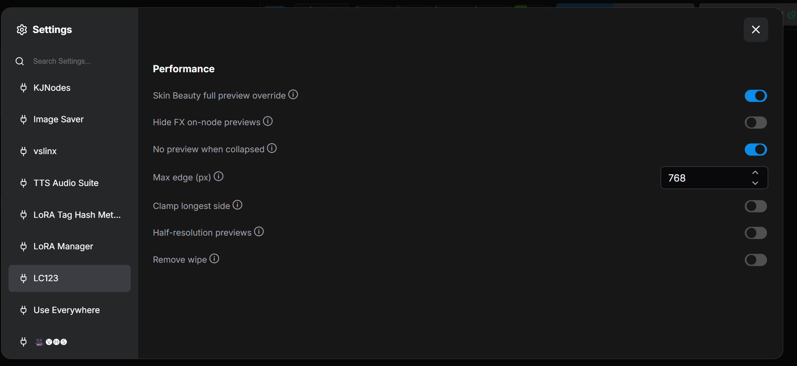
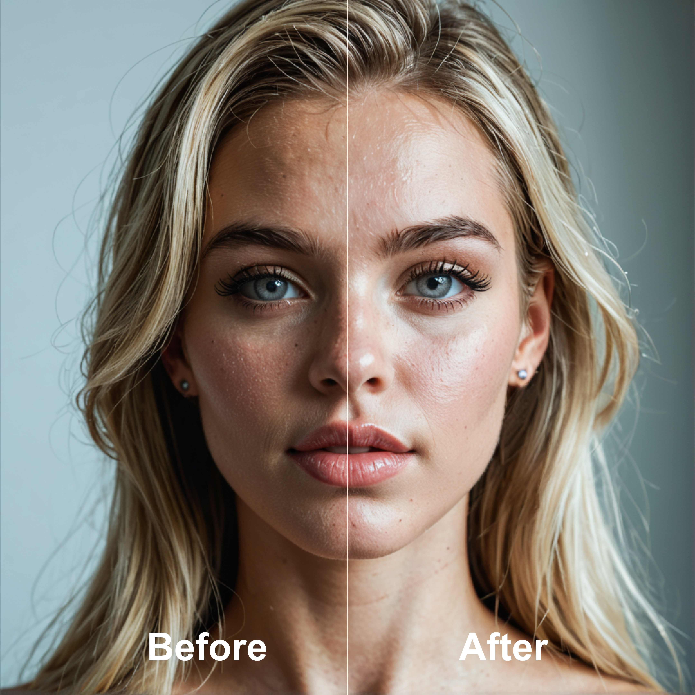
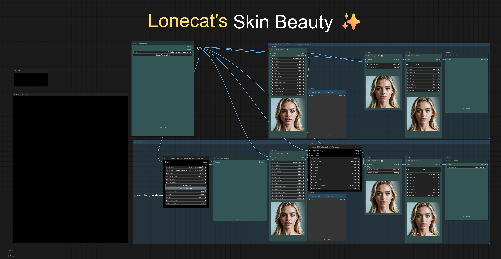

# ComfyUI LC123 Nodes

Custom nodes for [ComfyUI](https://github.com/comfyanonymous/ComfyUI) by [lonecatone23](https://github.com/lonecatone23).

- **Repo:** [https://github.com/lonecatone23/ComfyUI_LC123_nodes](https://github.com/lonecatone23/ComfyUI_LC123_nodes)
- **Civitai:** [lonecatone23](https://civitai.com/user/lonecatone23)
- **Instagram:** [synth.studio.models](https://www.instagram.com/synth.studio.models/)
- **Support:** [Buy me a ☕](https://ko-fi.com/lonecatone)
- **Version:** 1.17.0 · **93 nodes**

> Small tools that remove friction — less wire mess, fewer clicks, clearer workflows.

> **"True, nothing is. Permitted, everything is"**  
> — Yoda Auditore, *Assassin's Wars*

For **Anima regional attention**, also install [Sen-sou Anima Regional Conditioning](https://github.com/Sen-sou/Comfyui-Anima-Regional-Conditioning).

Release history lives in **git tags**. This page describes the pack **as it is now**.

---

## LC Lighting Control 🔦

Post-process **spotlight relight** from a **normal map** + **depth map** (optional subject mask). Same image, new light and shade — no re-generation.


| Input | Role |
|--------|------|
| **image** | Photo / render to relight |
| **normal_map** | Surface facing (BAE / DSINE recommended) |
| **depth_map** | Near vs far (Depth Anything V2 recommended; invert if bright = near and lighting looks inside-out) |
| **mask** (optional) | Subject matte. Used only when **mask_enabled**. High blend can fringe — ~0.2–0.45 or leave off |

**Math (plain):** each pixel is multiplied by how much light hits it. Facing the key = brighter; turned away or blocked in depth = darker. Ambient is the floor so shadows don’t crush to black. No color tint.

- **XYZ** = aim. **`+X` = from the right** · **`+Y` = from above** · **Z 0…1** (1 = front)
- **Size** = cone width (spot → flood)
- **Intensity 0** = that light is off (no light, no shadow)
- Two lights, each with its own aim and shadows
- **Light stage** under the sliders: white = light 1, red = light 2. Drag XY; Shift+drag / wheel = Z

Outputs: **image** (relit) · **debug_mask** (ignore).

External (not bundled): Depth Anything V2, a normal-map preprocessor, optional remBG.

Example: [`workflows/LC Lighting Control (BETA).json`](workflows/LC%20Lighting%20Control%20(BETA).json)

---

## ⚙️ LC123 Performance (Settings)

**UI only** — smoother scrolling and lighter on-node previews. Does **not** change generation VRAM or socket output quality.

**Settings → LC123 → Performance**



| Setting | Default | Effect |
|--------|---------|--------|
| **Remove wipe** | Off | No hover wipe on image FX previews |
| **Half-resolution previews** | Off | FX previews at half the node image area |
| **Clamp longest side** | Off | Cap on-node preview bitmap size |
| **Max edge (px)** | 768 | Used when clamp is on |
| **No preview when collapsed** | On | Skip draw on collapsed FX nodes |
| **Hide FX on-node previews** | Off | Hide all LC image FX on-node previews |
| **Skin Beauty full preview override** | On | Skin Beauty stays full quality on-node |

**Not affected:** LC Image Compare · LC Dynamic Overlay · LC Image Split  

Full directions: [`LC123_Performance_Settings_Note.md`](LC123_Performance_Settings_Note.md)

---

## ✨ LC Skin Beauty

Mask-aware skin cooling and brightening in **CIELAB**. Grades **skin**, not the whole frame.



- Auto skin mask (eyes/lips protected; busy fabric suppressed)
- Optional **external MASK** (e.g. SAM person) intersects with auto skin
- Presets load the sliders; then **what you see is what runs**
- On-node wipe preview; outputs **image** + **skin_mask**



| Goal | Tip |
|------|-----|
| Natural cleanup | Preset **Natural** or **Warm keep**, strength ~0.7–1.0 |
| Less plastic | Lower **smooth**, raise **texture_preserve** |
| Fabric leaks | Lower **mask_sensitivity**, or feed a person/skin **MASK** |
| Check targeting | Inspect **skin_mask** output |

---

## 📷 LC Photo Style

Camera / phone **finish** (not lens geometry). Presets drive the sliders; most controls **0 = no change**. **Strength** blends with the original.

Presets: Standard, Natural, Dramatic, Quiet, Muted, Amateur, Cool day, Warm evening, Bright open, iPhone, **Nikon Z7 II**, **Canon R5**.

Full list: [`LC_Photo_Style_Note.md`](LC_Photo_Style_Note.md)

---

## 🔪 LC Sharpen Pro

Photorealism-first clarity + edge. Guided + box hybrid high-pass, auto halo, skin protect.

Presets: **Natural, Subtle, Portrait, Product, Landscape, Crisp** + art **Lineart, Anime sharp**. Move a slider after a preset → **Custom**.

- Realism / portraits: **Natural** or **Portrait**. Raise **clarity** before **sharpen**. Keep **halo** and **skin_protect** up on faces.
- **Crisp:** photo snap, not ink outlines.
- **strength** 1.0 = full effect; bypasser for a hard off.

---

## 🗒️ Prompt Builder

Modular stack → **🧩LC Prompt Assembler**.

```
Subjects + Scene + Camera + Lighting + Style + Palette
        → 🧩LC Prompt Assembler
              → prompt  → CLIP / conditioning
              → json    → Krea2 / Ideogram builder
```

| Node | Role |
|------|------|
| 🗒️LC Subject / Subject Array | Character + placement (bbox trailers for JSON) |
| 🗒️LC Scene / Camera / Lighting / Style | Environment & look |
| 🎨LC Color Palette | Preset or sample from image |
| 🎲LC Wildcard | Random line from `assets/wildcards/` |
| 🧩LC Prompt Assembler | `include_scene_bboxes` default off (subject boxes only) |


---

## 🖼️ Image & size

| Node | What it does |
|------|----------------|
| **📐 Aspect Ratio Simplifier** | Size from image, mask, or preset. Resize image + mask. Crop / stretch / pad / total pixels. Empty latent. Default upscale: **lanczos**. |
| **📐 Aspect Ratio Simplifier (pipe)** | Same + pipe out for Get/Set. |
| **LC Aspect Ratio Pipe Out** | Unpacks aspect pipe → image, mask, width, height, latent, batch, resolution. |
| **LC Get Image 📐** | Megapixels, width, height, batch, aspect, longer-side resolution. |
| **LC Dimension Resize 📐** | One value, add / sub / mul / div both sides; rounded outs. |
| **LC Image-Mask Resize 📐** | Image + mask only (no latent / batch). **match_aspect_ratio** keeps the input ratio on the longer settings side. **upscale_by:** none / multiplier (0.25) / megapixels (0.01). |
| **LC Image Crop 🖼️🔪** | Interactive crop with aspect lock. |
| **LC Image Compare 🔎** | Batch A/B, one slider per pair. |
| **LC Image Split 🖼️** | Saveable A\|B wipe (**slider only**). Output is the baked split. |
| **LC Image Grid 🖼️** | Contact sheet (columns, gap, pad, outline). |
| **LC Last Image Holder** | Holds last image; clear without re-run. |
| **LC Dynamic Overlay** | Overlay B on A; opacity after one queue. **blended Image** out. |
| **LC Watermark 💧** | Image watermark; size, opacity, drag place. |


---

## 🎨 Image FX (on-node preview + wipe)

Hover the node to wipe vs the original. Lighten UI load under **LC123 Performance**.

| Node | What it does |
|------|----------------|
| **LC Image Adjust** | Brightness, contrast, saturation, hue. |
| **LC Auto White Balance** | Auto WB. |
| **LC Sharpen Pro** | See above. |
| **LC Lens Effects** / **LC Lens Profile** | Lens-style FX. |
| **LC Lift Gamma Gain** | Color-wheel style lift / gamma / gain. |
| **LC Image RGB** | Per-channel RGB. |
| **LC Film Grain** | Grain overlay. |
| **LC Film Stock (B&W)** / **(Color)** | Stock looks. |
| **LC Vibrance** | Smart saturation. |
| **LC Vignette** | Edge darkening. |
| **LC Bloom** | Soft glow. |
| **LC Chromatic Aberration** | RGB fringe. |
| **LC Image Denoise** | Detail-preserving denoise. |
| **LC Color Match 🎨** | Match a reference (AdaIN / mean-std); **skin_protect**. Optional **mask**: white = match, black = keep image. No mask = full frame (old graphs unchanged). |
| **LC Tone Match** | Frequency lock: **image** = detail (Krea2 / Klein / Qwen), **reference** = lighting/color/size. **tone_match** + **refinement_strength** + **detail_radius**. Optional **mask** (white = lock, black = keep image). Wipe vs reference. |
| **LC Image Desaturate** | Desaturate. |
| **LC Skin Beauty ✨** / **LC Photo Style 📷** | See above. |
| **LC Apply LUT** | `.cube` from **`ComfyUI/models/luts/`**. Samples copy from `assets/luts/` on load, never overwrite. |
| **LC Text Overlay** | Text on image; align left/center/right; drag + widgets. |

---

## 🧪 Sampling · sigma · latent · pipes

| Node | What it does |
|------|----------------|
| **LC Sampler Configure** | Dual-pass: steps, swap, detailer, denoise, CFG1/2, sampler, scheduler. |
| **LC Sampler Configure (pipe)** | Same + optional pipe in / pipe out. |
| **LC Sampler Configure Simple** | Single CFG (no step_swap / cfg_2). |
| **LC Sampler Configure Simple (pipe)** | Simple + pipe in/out. |
| **LC Sampler Configure Pipe Out** | Unpack LC_PIPE → sampler sockets. |
| **LC Split Sigma Scheduler** | Split one schedule across two models. |
| **LC Split Sigmas (Advanced)** | Two sigma curves + models; denoise; fallback to 1 if 2 missing. |
| **LC Basic Scheduler** | Scheduler + steps → sigmas (no denoise). |
| **LC Reference Latent** | Up to 8 optional ref latents → conditioning. Empty = pass-through. |
| **LC Denoise 💉** | Latent inject: `noise_std = 1 − denoise`. |
| **LC Pipe (in/edit)** / **Pipe Out** / **Detail Pipe Out** | Bundle / unpack models, clips, VAEs, prompts, seed, steps… |
| **LC MiniMax H3 Pipe** | Pack / edit H3 refs. Top: **fl2va_model**, **fl2va_clip**, **ref2va_model**, **ref2va_clip**, video_vae, audio_vae, width, height, length, frame_rate, then ref_image_0… / ref_video_0… (fixed sockets, no autogrow). Pipe in accepts an H3 pipe (full merge) **or** Aspect Ratio Simplifier / LC Pipe (**width + height only**). |
| **LC MiniMax H3 Pipe Out** | Same sockets out. `ref_image_0` = `<Picture 1>` = MiniMax `ref_image_0`. |
| **Prompt to Conditioning** / **+ Zero** | String → conditioning. |
| **Positive / Negative** | Prompt boxes (green / red). |

---

## 📁 Save paths & text

| Node | What it does |
|------|----------------|
| **LC Easy Folder 📂** | `filename_prefix` for native Save Image. |
| **LC Advanced Folder 📂** | Split filename + path. |
| **📝 LC Save Text** | Write text; sanitizes illegal path characters. |
| **LC Join Strings 🔗** | Join N strings; empty slots skip the delimiter; `\n` allowed. |
| **LC Show Text 🔤** | Display text on the node. |
| **LC Text Replace ✂️** / **LC Text Remove 🔪** | Up to 20 pairs; grows with entry count. |
| **Civitai 🚩🔪** | Strip from `assets/lists/civitai_compliance_remove.txt`. **Your** TOS responsibility. |

---

## 🔀 Switches, logic & control

| Node | What it does |
|------|----------------|
| **LC AnySwitch** | First connected wins; type-locks from first wire. |
| **LC Any Index Switch** | Index widget (Convert to Input to wire INDEX) + dynamic `any_*` slots. |
| **LC Custom Combo** | `inputcount` options → STRING + INDEX + OPT_CONNECTION. |
| **LC Custom Combo Panel** | Compact remote for a combo hub. |
| **LC Combo Selector** | Dropdown that mirrors another node’s combo. |
| **LC Boolean** / **Invert Boolean** | Coerce to true/false. |
| **LC Boolean Switch** / **Flip** / **Value** | Pick / emit booleans. |
| **LC Int Compare** / **LC Float Compare** | Largest or smallest of two. |
| **LC Seed Jump 🌱** | One seed + jump → six stepped seeds. |
| **🌱LC Seed** | Seed with seed_mode (fixed / randomize / increment / decrement). |
| **LC Slider** | On-node slider (min/max/step/decimals in settings). |
| **LC Node Snapshot 📋** | Read another node’s widgets → value / dump / JSON. |
| **LC Notify 🔊** | Play a sound from `assets/sounds/` on run. Mode: always / on empty queue / **never**. ▶ preview still works when silent. |
| **LC Bypasser** / **Groups Bypasser** / **Bypasser Panel** | Remote bypass. |
| **LC Stop 🛑** | Pause until button. |
| **LC VRAM Cache Clear** | Clear VRAM / cache; pass-through. |

Manual node sizes stick across reload (auto-fit only on first create or when `inputcount` changes).

---

## 🎨 Regional canvas

| Node | What it does |
|------|----------------|
| **Anima Regional Inline Canvas** | RGB paint for Sen-sou Anima regional conditioning. |
| **Krea2 Regional Inline Canvas** | Same idea for Krea2 CLIP regions (**beta**). |

---

## 📂 Example workflows

| File | Description |
|------|-------------|
| [`workflows/LC Lighting Control (BETA).json`](workflows/LC%20Lighting%20Control%20(BETA).json) | Image → normals / depth / mask → Lighting Control |
| [`workflows/LC Node examples.json`](workflows/LC%20Node%20examples.json) | Tour of utility / image / prompt nodes |

Workflow → Open, or drag onto the canvas.

---

## 📦 Assets

| Path | Use |
|------|-----|
| `assets/readme/` | README screenshots |
| `assets/sounds/` | LC Notify |
| `assets/lists/` | e.g. Civitai compliance |
| `assets/luts/` | Sample LUTs → `models/luts/` on load if missing |
| `assets/wildcards/` | LC Wildcard |
| `assets/prompt_builder/` | Prompt Builder presets |

**Apply LUT path:** `ComfyUI/models/luts/` (not under custom_nodes).

---

## 💡 Quick tips

- **Lighting:** intensity ~1.0–1.3, ambient ~0.25–0.4, shadow strength ~0.4. Mask off if you see a grey fringe.
- **Performance:** heavy graphs → half-res + clamp, or hide FX previews.
- **Skin Beauty:** check **skin_mask**; lower sensitivity if fabric leaks.
- **Image Split:** set wipe, queue, save the **split** output.
- **Prompt Builder:** `prompt` → CLIP; `json` → regional builders only.
- **Reference Latent:** all slots empty = pass-through (bypasser-safe).
- **Denoise 💉:** same denoise number as the sampler; 1.0 = no inject.
- **H3 pipe:** Aspect Ratio Simplifier pipe → H3 **pipe** socket copies size only. Length / fps still need their own wires. MiniMax prompt tags are 1-based (`ref_image_0` = `<Picture 1>`).
- **Tone Match:** same crop only. Head-swap → mask off the new head (black). Not a color-match substitute.
- **Color Match mask:** white = regrade, black = original pixels. Optional; unconnected = old behavior.
- **Notify:** drop audio into `assets/sounds/`, restart once.

---

## Install

```text
ComfyUI/custom_nodes/ComfyUI_LC123_nodes/__init__.py
```

`__init__.py` must sit **directly** in that folder — not in `ComfyUI_LC123_nodes/ComfyUI_LC123_nodes/`. If you unzip a pack zip *inside* an existing clone, move the inner files up one level.

Restart ComfyUI. Console should print `[LC123] total 93 nodes`. Optional workflows in `workflows/`.

**Requirements:** ComfyUI’s Python env (`torch`, `numpy`). No extra pip packages. Depth Anything / SAM / remBG for lighting & masks are separate installs.

---

## License

MIT — see `LICENSE`.

**"True, nothing is. Permitted, everything is"**  
_Yoda Auditore. *Assassin's Wars*_
